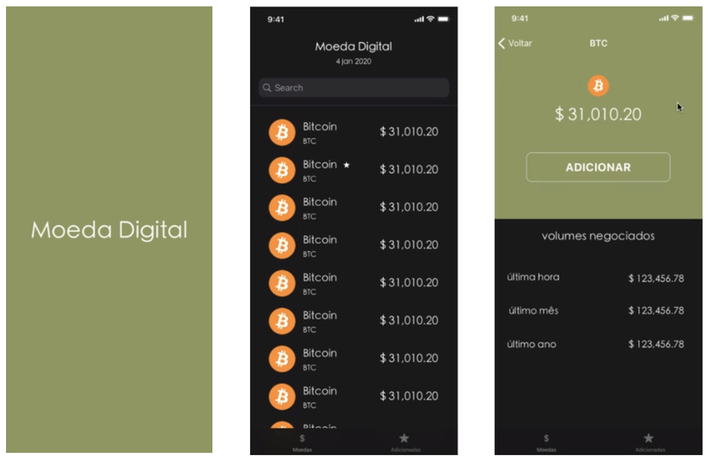
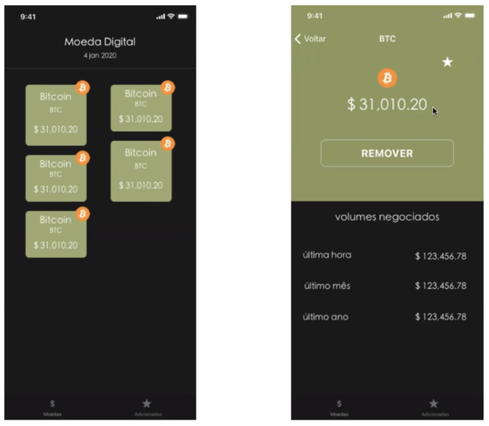

# Squad3ProjetoFinal

Onboarding mobile challenge 

Esse desafio busca orientar os desenvolvedores iOS, recém chegados, a respeito daquilo que enxergamos como boas práticas de desenvolvimento de software, no cliente Itaú. O desafio consiste em criar um aplicativo que se comunique via REST API, na plataforma CoinAPI (https://docs.coinapi.io/). É necessário que o app liste criptomoedas e que possibilite ver detalhes do volume transacionado de cada moeda, assim como adicionar moedas como favoritas.

Fluxo principal - Listagem de moedas

Fluxo alternativo - Tratativa dos erros (HTTP errors)

  1. 400 Bad Request -- There is something wrong with your request
  2. 401 Unauthorized -- Your API key is wrong
  3. 403 Forbidden -- Your API key doesnt't have enough privileges to access this resource
  4. 429 Too many requests -- You have exceeded your API key rate limits
  5. 550 No data -- You requested specific single item that we don't have at this

Para que esse desafio seja bem sucedido, devemos seguir os seguintes padrões:

  - Arquitetura MVVM; 
  - Testes unitários em XCTest;
  - Tratativa dos erros de API;
  - Acessibilidade, utilizar https://guia-wcag.com/ para referência;
  - Reaproveitamento dos objetos visuais;
  - Modularização.

As características funcionais e não funcionais do app consistem em:

  - Lista de moedas com scrolling infinito;
  - Adicionar uma moeda aos favoritos;
  - Visualização por hora, mês e ano do volume transacionado de cada moeda;
  - Controle de estado (se a moeda foi adicionada aos favoritos ou não);
  - Indicar como moeda favorita logo na tela de listagem das moedas;
  - A tela de listagem de favoritos deve ser um modulo a parte assim como a tela de detalhes (Só pode haver uma tela de detalhes para ser usada no superApp e no detalhamento de moedas favoritas);
  - Deve existir uma tela padrão para erro com a opção de “tentar novamente”;
  - O design deve ser o mais próximo possível do proposto acima.

Considerações:

  - O aplicativo irá consistir em um superApp e um modulo principal que ira listar as moedas favoritas;
  - Para funções e/ou componentes visuais em comuns entre superAPP E modulo principal deverá ser construído um segundo modulo “Commons” que será compartilhado entre SuperApp e modulo principal; 
  - Para favoritos deverá ser utilizado algum meio de persistência local como User defaults ou Realm (não salvando toda resposta da api, apenas chave valor para marcar uma moeda como favorito);
  - Utilização de swiftlint é obrigatória;
  - Deverá suportar a versão do iOS 10.
